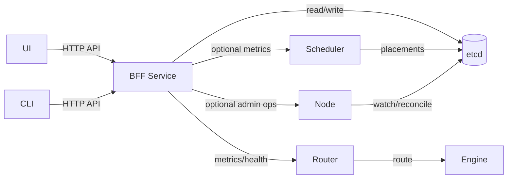
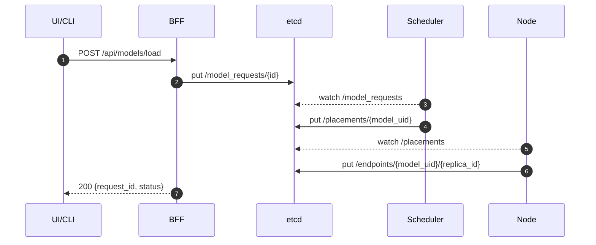
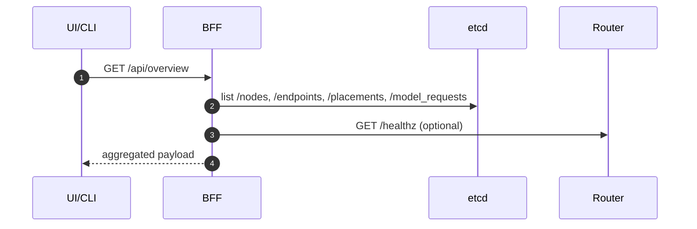

# BFF Components and Data Flow

## 1. Component View

## 2. Data Flow (Load Model)

## 3. Data Flow (Overview Read)

## 4. Notes

- BFF does not call gateway. Gateway remains unchanged.
- Node/Scheduler HTTP admin endpoints are optional and can be added later if needed.
- Logs and metrics aggregation can be integrated via external systems (Prometheus/Loki) without changing gateway.
