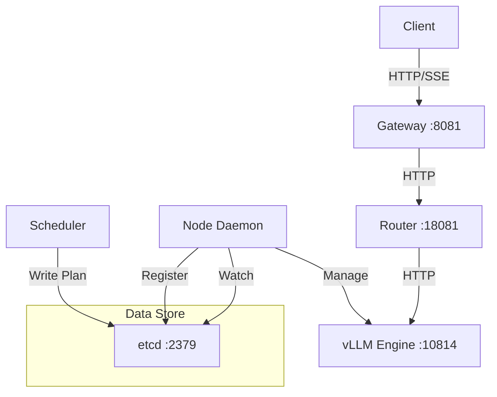

# Nebula Project Overview

## 1. Executive Summary

**Nebula** is a Rust-native control plane designed for high-performance LLM serving. It aims to replace the control plane of Xinference, addressing bottlenecks in scheduling, routing, and reliability. It employs a "Control Plane / Execution Plane" separation, where the control plane is written in Rust for stability and concurrency, and the execution plane uses Python (Engine Shim) to leverage the rich ecosystem of inference engines like vLLM.

## 2. Core Architecture

The system follows a declarative, reconcile-based architecture inspired by Dynamo/Kubernetes.

### Key Concepts
*   **Separation of Concerns**: Rust handles networking, scheduling, and state management. Python handles the actual model inference.
*   **Reconciliation**: The Scheduler writes a "PlacementPlan" (desired state) to etcd. Node Daemons watch these plans and reconcile the local state (start/stop engines).
*   **Gateway**: Provides OpenAI-compatible APIs (`/v1/chat/completions`) and a custom high-performance streaming API (`/v1/responses`).
*   **Router**: Implements intelligent routing (Least Connections, Session Affinity) to distribute traffic among healthy endpoints.

## 3. Component Deep Dive

| Component | Language | Responsibility | Key Features |
| :--- | :--- | :--- | :--- |
| **nebula-gateway** | Rust (Axum) | API Entry Point | • OpenAI-compatible Interface • Custom `/v1/responses` streaming (SSE) • Error mapping & Normalization • Request Context Injection (UUID, etc.) |
| **nebula-router** | Rust | Traffic Distribution | • In-memory state (DashMap) • Least-Connections Load Balancing • Session Affinity • Health & Version Filtering |
| **nebula-scheduler**| Rust | Global Planning | • Generates PlacementPlans • Writes to etcd • Currently supports `IdleFirst` strategy |
| **nebula-node** | Rust | Local Management | • Watches `/placements/` in etcd • Manages vLLM processes (lifecycle) • Registers endpoints (`/endpoints/`) • Health checks |
| **nebula-common** | Rust | Shared Types | • `ExecutionContext`, `EndpointInfo`, `PlacementPlan` definitions |

## 4. Current Implementation Status

Based on the documentation and codebase analysis:

*   ✅ **Basic Flow**: Validated End-to-End (Gateway -> Router -> vLLM).
*   ✅ **Streaming**: Both OpenAI-compatible (`chat/completions`) and custom (`responses`) streaming work.
*   ✅ **Routing**: Basic least-connections and session affinity are implemented.
*   ✅ **Infrastructure**: Uses etcd for metadata; Scheduler and Node rely on it.
*   🚧 **Embeddings**: Endpoint exists but currently returns 501 (Not Implemented) or proxies blindly.
*   🚧 **Engine Support**: Primarily focused on vLLM.

## 5. Developer Guide

### Prerequisites
*   Rust (stable)
*   etcd (v3.x)
*   Python environment with `vllm` installed
*   NVIDIA GPU environment

### Key Commands
*   **Build**: `cargo build --workspace`
*   **Run Scheduler**: `./target/debug/nebula-scheduler ...`
*   **Run Node**: `./target/debug/nebula-node ...`
*   **Run Router**: `./target/debug/nebula-router ...`
*   **Run Gateway**: `./target/debug/nebula-gateway ...`

### Code Highlights
*   **Gateway (`crates/nebula-gateway/src/main.rs`)**:
    *   Uses `axum` routing.
    *   `proxy_post` handles the complexity of proxying requests and SSE streams.
    *   `create_responses` implements the strict SSE format for the custom endpoint.
*   **Router (`crates/nebula-router/src/lib.rs`)**:
    *   Thread-safe state using `DashMap`.
    *   `route_with_plan_version` ensures routing effectively mirrors the scheduler's intent, avoiding "zombie" endpoints.
