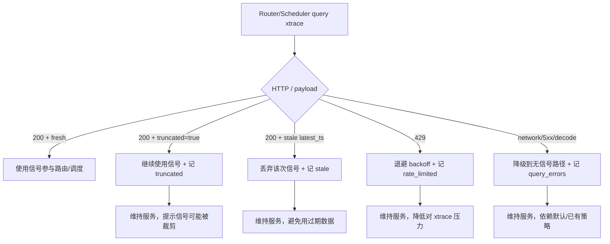

# xtrace Signal Contract Template (for Nebula Router/Scheduler)

本模板用于对齐 xtrace 与 Nebula 的信号契约，确保 Router 与 Scheduler 在正常、抖动、降级场景下都可预测。

## 1) Owner 与范围

- xtrace owner:
- Nebula owner:
- 生效环境:
  - dev:
  - staging:
  - prod:
- 生效日期:
- 兼容窗口（旧契约保留时长）:

## 2) 标准连接约定

- 标准 URL（唯一来源）:
- 鉴权模式（service/internal）:
- token 来源与轮换策略:
- 端口与路径基线:
  - metrics query path:
  - traces path:
- 连接超时建议:
- 查询超时建议:

## 3) 指标契约（P0 必填）

### 3.1 pending_requests

- 指标名: pending_requests
- 类型: number
- 单位: count
- 合法范围: >= 0
- labels（必填）:
  - model_uid:
  - replica_id:
- 缺失 labels 行为:
- 空结果语义（无数据时）:

### 3.2 kv_cache_usage

- 指标名: kv_cache_usage
- 类型: number
- 单位: ratio
- 合法范围: [0, 1]
- labels（必填）:
  - model_uid:
  - replica_id:
- 计算口径（used/total）:
- 缺失 labels 行为:
- 空结果语义（无数据时）:

### 3.3 prefix_cache_hit_rate

- 指标名: prefix_cache_hit_rate
- 类型: number
- 单位: ratio
- 合法范围: [0, 1]
- labels（必填）:
  - model_uid:
  - replica_id:
- 统计窗口:
- 缺失 labels 行为:
- 空结果语义（无数据时）:

## 4) 查询语义与返回稳定性（P0/P1）

- 支持聚合:
  - last:
  - avg:
  - max:
- last 的精确定义:
- step 参数语义:
- from/to 边界语义:
- 无数据时返回:
  - 空 series:
  - 0 值:
  - null:
- 部分成功语义（部分 series 有数据）:
- 时间戳字段与时区约定:

## 5) Freshness 与可用性 SLO（P1）

- 推荐 freshness 阈值（Router）:
- 推荐 freshness 阈值（Scheduler）:
- 目标查询成功率（5 分钟窗口）:
- 目标 p95 延迟:
- 目标 p99 延迟:
- 短时抖动容忍策略建议:

## 6) 错误模型（P0 必填）

请给出 machine-readable code 与 HTTP 状态映射：

| 场景 | HTTP | code | 可重试 | 说明 |
| --- | --- | --- | --- | --- |
| 鉴权失败 |  |  |  |  |
| 参数错误 |  |  |  |  |
| 限流 |  |  |  |  |
| 上游超时 |  |  |  |  |
| 内部错误 |  |  |  |  |

补充：
- 错误体 schema:
- request id 字段:

## 7) 限流与容量建议（P1）

- 单客户端推荐 QPS（Router）:
- 单客户端推荐 QPS（Scheduler）:
- burst 限额:
- 超限返回语义:
- 建议 backoff 策略:

## 8) 向后兼容与版本策略（P2）

- 契约版本号:
- 破坏性变更流程:
- 提前通知周期:
- 双栈兼容期:

## 9) 对接测试样例（P0 必填）

请提供可复现样例（请求 + 期望响应）:

1. 正常有数据
2. 正常空数据
3. 部分数据缺失
4. 鉴权失败
5. 限流
6. 服务内部错误

## 10) 验收标准（双方签字）

### 10.1 Router 侧验收

- 24 小时内无解析失败（labels/类型/范围）
- freshness 过期数据被正确降级
- 无信号时策略可回退且可观测

### 10.2 Scheduler 侧验收

- autoscaling 信号可用率达标
- xtrace 抖动时不出现误扩缩容

### 10.3 联合验收

- prefix_cache_hit_rate 在策略中可见生效
- 错误码驱动的降级路径可复现

## 11) 变更记录

| 日期 | 变更人 | 变更内容 |
| --- | --- | --- |
|  |  |  |

## 12) Nebula 降级路径可观测（一页图）

用于统一理解：xtrace 信号异常时，Nebula 走哪条分支，以及应看哪个计数器。

### 12.1 指标名对照

- Router:
  - `nebula_router_xtrace_query_errors_total`
  - `nebula_router_xtrace_rate_limited_total`
  - `nebula_router_xtrace_stale_total`
  - `nebula_router_xtrace_truncated_total`
- Scheduler:
  - `nebula_scheduler_xtrace_query_errors_total`
  - `nebula_scheduler_xtrace_rate_limited_total`
  - `nebula_scheduler_xtrace_stale_total`
  - `nebula_scheduler_xtrace_truncated_total`

### 12.2 判定口径（当前实现）

- stale：`series_count > 0` 且 `meta.latest_ts` 距今超过 `NEBULA_XTRACE_METRIC_MAX_AGE_MS`。
- rate_limited：HTTP `429`（优先使用 `Retry-After` 作为退避秒数）。
- query_errors：请求失败、非 2xx（且非 429）、或响应解析失败。
- truncated：`meta.truncated = true`。

### 12.3 验收建议

- 至少验证两类场景能稳定抬升计数：`429` 与 `query_errors`。
- `stale` 若受环境影响难稳定触发，可先以 `query_errors` 证明降级路径已可观测，再单独做 stale 专项注入。
